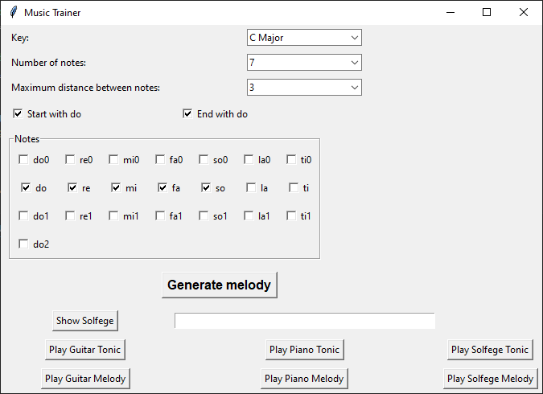

This is a small python application that generates short melodies for ear training. 
The program can be used for ear training in 2 ways.
For both, start by making your optional selections and then click "Generate melody".
1. Listening test: Click the 3 "Play ___ Tonic" buttons to orient yourself to the tonic note "do", then click "Play Guitar Melody" and/or "Play Piano Melody".
Sing out loud the corresponding solfege based on your interpretation of the melody, and then optionally play the same melody on your instrument.
Click "Show Solfege" and "Play Solfege Melody" to see whether you interpreted the melody correctly.
3. Singing test: Click "Show Solfege" and then the 3 "Play ___ Tonic" buttons. Based on the sound of the tonic note "do", hum the solfege melody out loud.
Then click the 3 "Play ___ Melody" buttons to listen and check whether you sang them correctly. Optionally, play the melody on your instrument.

Up to 3 octaves can be used to generate the melody.
Currently the program supports the keys of C major and G major, but more keys can be added if you put the mp3s in the mp3 folder and then add their names and locations to the Mapping.txt file.

