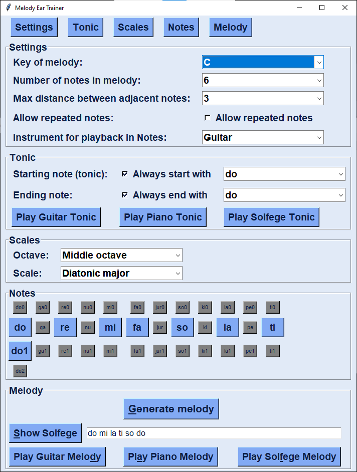

This is a small python application that generates short melodies for ear training using movable-do solfege and sotorrio for the accidentals. Both la-based and do-based minor keys are supported in practice. 
The program can be used for ear training in 2 ways: "Listening test" and "Singing test".

*Listening test:* 

1. Make your key, note, and length of melody selections
2. Click "Generate melody"
3. Click the 3 "Play ___ Tonic" buttons to orient yourself to the tonic note
4. Click "Play Guitar Melody" and/or "Play Piano Melody"
5. Sing out loud the corresponding solfege based on your interpretation of the melody
6. Play back the melody on your instrument (optional)
7. Click "Show Solfege" and "Play Solfege Melody" to see whether you interpreted the melody correctly.

*Singing test:*

1. Make your key, note, and length of melody selections
2. Click "Generate melody"
3. Click "Show Solfege" to display the written solfege of the generated melody
4. Click the 3 "Play ___ Tonic" buttons to orient yourself to the tonic note
5. Based on the sound of the tonic note "do", hum the solfege melody out loud
6. Then click the 3 "Play ___ Melody" buttons to listen and check whether you sang the melody correctly. 
7. Play back the melody on your instrument (optional)

The program supports all 12 keys with 3 octaves of each key.

To download and install the program on Windows, go to the "dist" folder above, then download "melody_ear_trainer.zip", unzip, and run. This program is free and open source.

